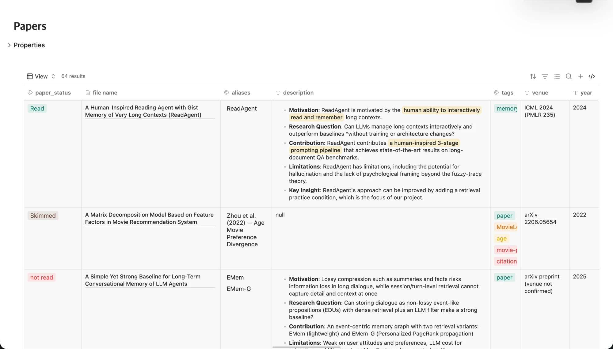
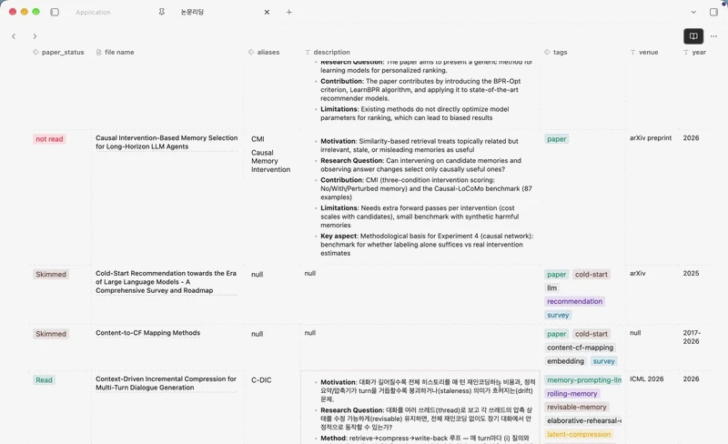
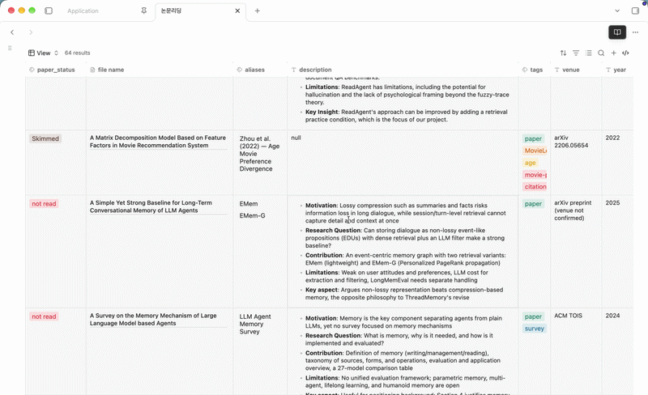
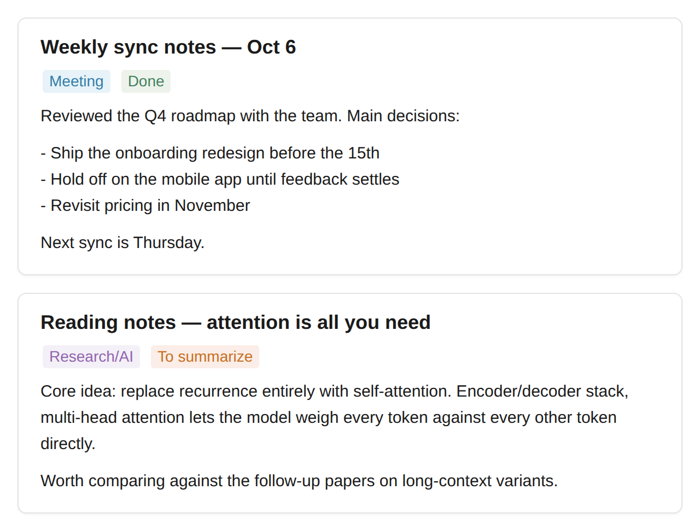
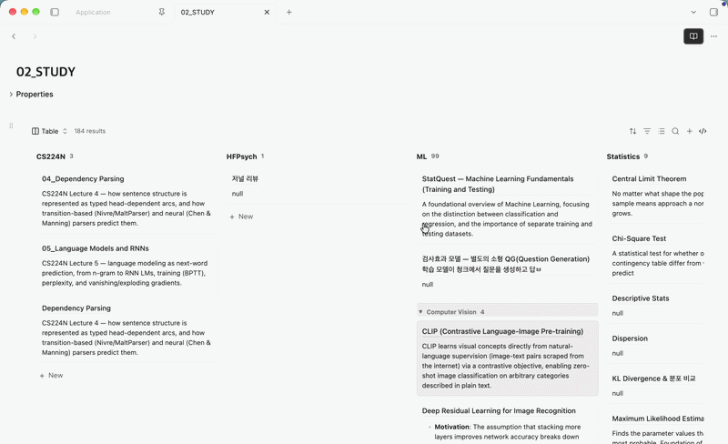
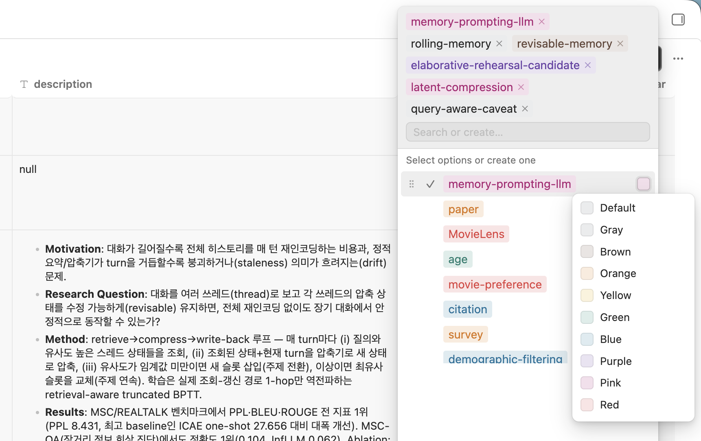
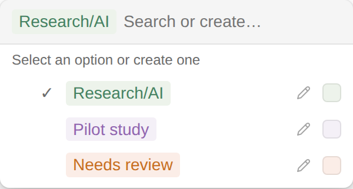

# Extended Base

Notion-style views for [Obsidian Bases](https://help.obsidian.md/bases) —
**Table**, **List**, **Board**, and **Feed**. Clean chrome, colored value
pills, inline cell editing, nested collapsible groups (with first-class
support for grouping by folder), and a Notion-style page panel for editing
a note without leaving the view.

By [Lucy Roh](https://github.com/jiwooroh).
If you like the plugin,[](https://buymeacoffee.com/jiwooroh)



> Requires Obsidian **1.10.2+** with the **Bases** core plugin enabled.

> **Extended Base is a fork** of [GoodBases](https://github.com/FrancescoUmberto/GoodBases)
> by Umberto Francesco Carolini (MIT). v1.0.1 adds the List and Board
> views, nested groups, column resizing/renaming, and per-column
> options on top of GoodBases 0.5.3. See [Credits](#credits).

## The four views

Pick one from the base's view selector. All four share the same pill
colors, select editor, inline editing, folder/nested grouping, and page
panel.

### Notion Table

The full database grid.

- **Resizable columns** — drag the border between two headers; widths are
  saved per view and aren't capped once you've resized past the default.
- **Drag to reorder, click to sort** — press and drag a header to move
  the column; a plain click sorts by it (ascending → descending → off).
- **Rename a column** — double-click a header title, type, Enter. The
  original property name is untouched; only the display name changes.
- **Per-column right-click menu** — **Change icon** (a searchable Lucide
  icon picker) and **Change property name**, plus toggling text wrapping
  and (for pill columns) turning off automatic pill colors.
- **Property-type icons** — each header shows an icon matching the
  property's type (text, number, checkbox, date, tags), or whatever icon
  you've picked for it.
- **Nested, collapsible groups** — including a dedicated, folder-aware
  layout when grouping by `file.folder`. See [Nested & folder
  groups](#nested--folder-groups).
- **Row limit** — a subtle `Rows: 50 ▾` control in the footer caps how
  many rows render (10 / 20 / 50 / All).





### Notion List

A compact one-line-per-note layout: the note title on the left, its
properties on the right. Same grouping (including folder grouping),
pills, and inline editing as the table, minus the grid. The *Row count
limit* view option decides how many rows to draw (`0` or `all` for no
limit).

### Notion Board

A Kanban board built from the base's grouping: one column per group,
one card per note.

- Cards show the note title (wrapping onto multiple lines if it's long,
  rather than truncating or stretching the column) plus every visible
  property.
- **Column width** — a view option with three fixed presets (Small /
  Medium / Large) for every column's width.
- Notes with no group value collect under **No Status**.
- Each column has its own **+ New** at the bottom.
- Right-click a column header for **Set color** (the same Notion-palette
  picker the pill select editor uses — pins a color for that group) and
  **Hide group**, which collapses the column to a short pill-shaped strip
  at the right edge of the board instead of dropping it — click the strip
  to bring the column back. (Which groups are collapsed is stored in the
  *Hidden groups* view option.) The **Show group color as** view option
  controls whether a group's color shows as its heading's pill, a faint
  wash across the whole column, both, or neither.
- **Folder grouping** gets its own layout, consistent with the table and
  list views — see the next section. Board columns stay one-per-top-level-
  folder even when a vault's folders nest several levels deep; a
  subfolder's notes show up as a collapsible labeled section *inside*
  its parent's column instead of spawning a column of their own.

Group keys containing `/` that *aren't* a folder (e.g. a tag like
`Project/Alpha`) render as stacked, indented pills in the column header —
so `Project/Alpha` shows both levels.

> Cards are not drag-and-drop yet; change a note's group from the card's
> own pill cell or the page panel.

### Notion Feed

A vertical feed of full note cards — title, a row of colored pill
properties, and the note's own body shown directly in the card.

- The body isn't a read-only preview — it's the note's own live editor
  (the same one Obsidian uses for a normal tab) embedded right in the
  card, so you can read and edit in place without opening anything.
- The title and pill properties work exactly like the other views:
  click a title to open the note (in a tab, or the page panel if *Open
  notes in* is set to that), click a pill to edit it in the shared
  select editor.
- **Card count limit** — a view option (default 5) caps how many cards
  render at once, since each one carries a full embedded editor.
- Supports the same folder/property grouping as the list view.



## Nested & folder groups

Group by a property whose values use `/` as a separator and Extended Base
builds a real tree instead of a flat list. `Work/Client/Alpha` becomes
three nested levels, each with its own collapsible header (labeled with
just that level's own segment) and a count of everything beneath it.
Click **▼** / **▶** on any header to fold it. This only affects *group
headers* — an ordinary pill (in a cell, the select editor, a feed card's
meta row) always shows its full value, `/` included.

**Grouping by `file.folder` gets a dedicated layout**, since Bases
produces one flat group per folder and a folder path isn't really a tag.
Extended Base detects a folder grouping (by checking whether every
group's key is an actual folder in the vault — there's no public API for
reading which property a view is grouped by) and then:

- Shows a bold plain-text label instead of a colored pill (or, with the
  *Show group color as* board option, a colored pill of its own), with
  just the name of the folder that directly contains those files.
- **Nests subfolders under their real parent**, matching the vault's
  actual folder tree exactly. If `UT Austin` and `UT Austin/Short Answer
  Questions` are both groups, the second nests under the first; a folder
  that's only a pass-through (holds nothing of its own, just subfolders —
  e.g. `Application` in `Masters/Application/UT Austin`) still gets its
  own (empty) heading, with its real subfolders nested inside it, rather
  than disappearing and leaving those subfolders looking like unrelated
  top-level groups. A group that's genuinely nested gets one flat indent
  step in the table and list views (not one step per level of depth) so a
  subfolder reads as nested without the tree marching further right the
  deeper it goes.
- **Hides a chain of top-level wrapper folders.** If grouping leaves
  exactly one top-level folder in view (a vault or project often has one,
  e.g. `Masters`, holding only `Application`, itself holding nothing but
  the real project folders), its name — and that of every single-child
  folder below it — is dropped, so the real project folders become the
  visible top level directly. With several unrelated top-level folders at
  any point in that chain, nothing further is hidden, since each name is
  the only thing telling them apart from there down.
- **In the board view**, since a Kanban board has no way to show
  indentation, only the top-level folder becomes a column; any subfolder
  nested inside it (however many levels deep) is flattened into that
  column as its own labeled, collapsible section instead of a separate
  column.



## The page panel

Click **+ New** (in the footer, in a board column, or the base toolbar's
**New** button) to create and edit a note in a centered Notion-style
panel, without leaving the view. To open *existing* notes there too, set
the **Open notes in** view option to *Page panel* — clicking a note title
then opens the panel instead of a tab (Ctrl/Cmd-click still opens a tab):

- **Title** — a real heading; type to rename the note, Enter jumps to the
  body.
- **Properties** — the note's frontmatter, editable exactly like the
  table: pill values open the select editor (with the color picker),
  checkboxes toggle in place, text and numbers edit inline.
- **Body** — rendered as formatted Markdown; click it to edit the source,
  click away and it renders again. Changes save automatically as you type.
- An **open-in-new-tab** button next to the close button saves pending
  edits and opens the note in a tab.

## Features

- **Theme-aware chrome** — text, borders, hover states, and the view's own
  background all come from Obsidian's active theme, so Extended Base
  matches whatever theme (not just light/dark mode) you have installed.
- **Colored pills** — list properties (tags, multitext) and single-choice
  `select` properties render as pills using Notion's 9-color palette, with
  accurate light- and dark-mode values. Colors are assigned by a
  deterministic hash, so a value keeps its color forever — unless you
  choose your own. A pill always shows its full value (`/` included) —
  see [Nested & folder groups](#nested--folder-groups) for the one place
  `/` does get split: group headers.
- **Per-value color picker** — click the colored square on the right of
  any row in the pill select menu and pick from Notion's palette, or
  **Default** for no color. Your choice is saved and applies everywhere
  that value appears. (You can also set colors in bulk with the *Pinned
  pill colors* view option — `value=color`, e.g. `Done=green`.)

  

- **Select editor** — pill cells open a select-style menu listing every
  value already used for that property, with a checkmark on the selected
  ones, search, and create-on-Enter. Drag a row's grip handle to reorder
  the option list — sorting a table column by that property (click its
  header) follows the order you set instead of alphabetical. Click the
  pencil icon (or double-click the pill) to rename a value everywhere it's
  currently used — every note holding it gets rewritten, in the
  background, as you confirm the new name.

  
- **Inline editing** — click a cell to edit text and numbers in a
  floating input sized to the cell; long text opens a textarea (Enter
  saves, Shift+Enter adds a newline). Checkboxes toggle in place.
- **Markdown in cells** — text and multitext values render as Markdown,
  so links and formatting work inside a cell.
- **Path-stripped link values** — an internal link or file value that
  looks like a path displays only its last segment (`Folder/Note` shows as
  `Note`); ordinary text is left exactly as written, even if it happens to
  contain a `/`.
- **Grouping** — follows Bases' own native **Group by** control (in the
  base toolbar, not a plugin setting), with the nesting, folder handling,
  and collapsing described in [Nested & folder
  groups](#nested--folder-groups).

## Usage

1. Enable the **Bases** core plugin and create a base.
2. In the base toolbar, open the view selector and choose **Notion
   Table**, **Notion List**, **Notion Board**, or **Notion Feed**.
3. Configure columns, filters, sorting, and grouping with the normal
   Bases controls. Each view adds its own settings on top:

| Option | Table | List | Board | Feed |
| --- | :---: | :---: | :---: | :---: |
| Wrap all content | ✅ | | | |
| Show vertical lines | ✅ | | | |
| Row / card count limit | ✅ (footer) | ✅ | | ✅ |
| Column width (Small/Medium/Large) | | | ✅ | |
| Show group color as (Off/Label/Background/Both) | | | ✅ | |
| Open notes in | ✅ | ✅ | ✅ | ✅ |
| Hidden groups | | | ✅ | |
| Properties to show as colored pills | ✅ | ✅ | ✅ | ✅ |
| Pinned pill colors | ✅ | ✅ | ✅ | ✅ |

Column widths, order, sort, icons, renamed headers, per-column wrapping,
and per-column color toggles are all set directly on the table (drag /
click / double-click / right-click) and persist in the view config.

Notes on editing:

- Only note frontmatter properties (`note.*`) are editable; `file.*` and
  `formula.*` columns are read-only by nature.
- `tags` pills are intentionally read-only for now — tags have special
  semantics and deserve a careful write path.

## Installation

Extended Base is not in the community plugin browser. Install it manually:

1. Build it (see [Development](#development)) or download `main.js`,
   `manifest.json`, and `styles.css` from a release.
2. Put them in `VaultRoot/.obsidian/plugins/extended-base/`.
3. Reload Obsidian and enable the plugin in **Settings → Community
   plugins → Installed plugins**.

### Optional: Notion-style toolbar

The blue Notion-style **New** button and icon-only Sort / Filter /
Properties / Search are an **optional CSS snippet** — the toolbar is core
Obsidian UI, outside the plugin's views, so the plugin doesn't style it:

1. Copy
   [`snippets/extended-base-notion-toolbar.css`](snippets/extended-base-notion-toolbar.css)
   into `VaultRoot/.obsidian/snippets/`.
2. Enable it under **Settings → Appearance → CSS snippets**.

Once enabled, the snippet restyles every Bases toolbar, not just Extended
Base views.

## Development

```bash
npm install
npm run dev    # esbuild watch mode with inline sourcemaps
npm run build  # type-check + production bundle → main.js
```

Point the repo (or a symlink) at
`VaultRoot/.obsidian/plugins/extended-base/` and reload the
plugin in Obsidian after each build.

Source layout:

- `src/main.ts` — registers the four Bases views.
- `src/view/notion-table-view.ts`, `notion-list-view.ts`,
  `notion-board-view.ts`, `notion-feed-view.ts` — one file per view.
- `src/view/note-modal.ts` — the page panel; `select-editor.ts` — the pill
  select menu.
- `src/lib/` — pill detection, the Notion color palette, group-tree and
  folder-group building, frontmatter and value helpers.
- `src/view-options.ts` — the per-view settings shown in the Bases toolbar.

## Roadmap

- ✅ **Feed view** (1.1.0) — a vertical feed of note cards with a live,
  directly-editable embedded body.
- ✅ **List and Board views** (1.0.1) — a compact list layout and a Kanban
  board built from the base's grouping.
- ✅ **Nested groups** (1.0.1) — `/`-separated group values become a
  collapsible tree with per-level counts.
- ✅ **Column resizing and renaming** (1.0.1) — drag column borders,
  double-click a header to rename; both persist per view.
- ✅ **Folder-aware grouping** — a dedicated layout for grouping by
  `file.folder`: real parent/subfolder nesting, a flat indent step instead
  of one per level, hiding a single top-level wrapper folder, and (in the
  board view) nested subfolders as collapsible sections instead of their
  own columns.
- 🔵 **Drag-and-drop cards** — move a card between board columns to
  rewrite its group property.
- 🔵 **Calculated footers** — a Notion-style per-column *Calculate* row
  (count, sum, average, and more).
- 🔵 **Editable tags** — extend the select editor to write `tags` safely
  (currently read-only).
- ⚪️ **Gallery view** — card galleries with cover images.

## Changelog

### 1.1.1

- **Fixed:** an empty/absent property showed the literal text `null` in a
  cell, instead of staying blank — and could show up as a spurious
  `null` entry in a pill column's own list of known values. Bases
  represents "no value" with a `NullValue` object (not plain
  JavaScript `null`), whose `toString()` returns the string `"null"`;
  every "is this value empty?" check here compared against JS
  `null`/`undefined` only, so a `NullValue` slipped through and got
  rendered as text. Now treated as empty everywhere a value's presence
  gates rendering, inline-edit prefill, sorting, and the pill value
  list.
- **Fixed:** a scalar pill property (e.g. a `select`-typed `status` or
  `priority`) didn't open the select editor on click in a base using
  the legacy `type: bases` view declaration — it fell through to plain
  text editing instead. That declaration hands properties to the view
  already normalized to their bare name (no `note.` prefix), and
  editability was decided with `prop.startsWith('note.')`, which a
  prefix-less id never matches. Now editable unless a property is
  explicitly `file.*` or `formula.*`.

### 1.1.0

- **Added:** a fourth view, **Notion Feed** — a vertical feed of full note
  cards (title, colored pill properties, and the note's body), styled
  consistently with the other three views and sharing their pill/color/
  grouping code. The body is the note's own live editor embedded directly
  in the card, not a read-only preview, so you can edit it in place. See
  [Notion Feed](#notion-feed).
- **Added:** `select` (single-choice) properties — a widget type some
  property-editing plugins (e.g. Property Panels) register, or a vault
  property typed that way — are now auto-detected as pill columns, the
  same way `tags`/`multitext`/`aliases` already were. Previously a
  `select` property's cells weren't recognized as editable by this
  plugin at all, so clicking one fell through to Obsidian's own built-in
  list-property editor instead of this plugin's pill menu.
- **Added:** a pencil icon next to a pill's color button in the select
  editor — click it (or still double-click the pill) to rename that
  value everywhere it's used. Previously renaming only worked via the
  easy-to-miss double-click gesture.
- **Changed:** a pill always shows its full value now, `/` included — a
  select option named `A/B` used to display as just `B` (the same
  last-segment stripping group headers use for `/`-nested tag paths was
  being applied to every pill's own label too). Group headers are
  unaffected: a `Work/Client/Alpha` grouping still shows one level per
  header, as before.
- **Removed:** the base's own scroll region and sticky table header. The
  view no longer caps its own height and creates a second, independent
  scrollbar (`height: 100%; max-height: 100vh` on the view root) — it now
  grows to its natural content height and the surrounding pane scrolls it
  like any other content. The tradeoff: the table header no longer stays
  pinned to the top while you scroll past it.
- **Fixed:** the pill select menu could, in rare cases, stretch to fill
  the entire window height as a mostly-empty box below its actual (much
  shorter) content, instead of sizing to fit it.

### 1.0.9

- **Added:** board view **Show group color as** setting (Off / Label
  only / Background only / Both) — colors a folder-grouped column's
  heading like a pill and/or tints the whole column with a faint wash of
  the group's color. Off by default, so existing boards look unchanged.
- **Added:** right-click a board column header → **Set color** opens the
  same Notion-palette color picker the pill select editor uses, letting
  you pin a color for that group directly from the board.
- **Changed:** the Notion color palette now uses the exact light/dark
  background and text values from Notion's own published color
  reference, in place of the previous approximated set — this changes
  the precise shade of every pill across all three views.
- **Changed:** a hidden board group's collapsed strip is now colored
  like a pill (matching the group's assigned color) instead of a plain
  bordered box, and the strips stack vertically in one narrow rail at
  the right edge of the board — reading normally left to right — instead
  of each being a separate full-height, rotated-text column.
- **Changed:** folder grouping now shows a pass-through folder (one that
  holds no files of its own, only subfolders — e.g. `Application` inside
  `Masters/Application`) as its own (empty) label with its real
  subfolders nested inside, rather than skipping it and promoting those
  subfolders to look like unrelated top-level groups. Hiding the
  top-level wrapper folder now also unwraps a whole chain of such
  single-child wrapper folders (e.g. both `Masters` and `Application`),
  not just the outermost one.
- **Changed:** board view's column width presets are a bit narrower
  (Small/Medium/Large: 220/280/360px → 200/240/320px).
- **Fixed:** a long pill label in a board column header (a folder name or
  a deeply nested tag) could push the header past the column's fixed
  width instead of truncating with an ellipsis.

### 1.0.8

- **Added:** board view **Column width** setting — three fixed presets
  (Small / Medium / Large) instead of a single hardcoded width.
- **Added:** folder grouping now nests a subfolder under its real parent
  folder (e.g. `UT Austin/Short Answer Questions` nests under
  `UT Austin`) instead of flattening every folder group to one level,
  across all three views.
- **Added:** a single top-level wrapper folder (e.g. an `Application`
  folder with nothing of its own but subfolders) is hidden from the
  group list — its subfolders become the visible top level directly.
- **Added:** List view now gets the same folder-grouping treatment as the
  table — bold plain-text labels, real nesting, and the top-folder-hiding
  behavior above — instead of its previous colored-pill layout.
- **Added:** board view folder grouping keeps one column per top-level
  folder; a nested subfolder (any number of levels deep) now renders as a
  collapsible labeled section *inside* its parent's column, with a ▼/▶
  toggle and its own card count, instead of becoming its own column.
- **Fixed:** a long card title in the board view could force its column
  wider than its configured width; titles now wrap onto multiple lines
  within the fixed column width instead.
- **Fixed:** excess vertical spacing between consecutive groups in the
  list view (and, separately, the table view's group-header row) — group
  headers now take up about the same space as a normal row.

### 1.0.7

- **Added:** the table view's column headers now stay visible while
  scrolling through a long list of rows — the table gets its own scroll
  region so the header can pin to its top.
- **Changed:** grouping by `file.folder` now renders as a single flat
  level — just the folder that directly contains the files, not the full
  vault-root-down path — as a bold plain-text label instead of a colored
  pill, in both the table and board views. Detected by checking whether a
  group's key is an actual folder in the vault, since Bases has no public
  API for reading which property a view is grouped by.
- **Added:** breathing room between consecutive groups in the table view,
  and the group-header row no longer picks up a background from elsewhere.
- **Added:** hiding a board column (right-click → *Hide group*) no longer
  drops it without a trace — it collapses to a narrow strip at the right
  edge of the board with the group's name rotated vertically; click it to
  bring the column back.

### 1.0.6

- **Fixed:** text and multitext cells truncated at the first `/` — pill/path
  values are meant to show only their last path segment, but that stripping
  was being applied to every rendered value, so ordinary text containing a
  `/` (a fraction, a date, `"km/h"`, …) got cut short. It's now applied only
  to genuine link/file values.
- **Fixed:** colors were a fixed Notion light/dark palette instead of the
  active Obsidian theme. Text, borders, hover wash, and the view's own
  background now come from Obsidian's theme variables, so a custom theme —
  not just light/dark mode — is followed everywhere.
- **Fixed:** rows could look misaligned because Markdown-rendered cells
  carry a paragraph's own margin while plain cells (numbers, dates, pills)
  don't; that margin is now reset so every cell lines up on the same
  baseline.
- **Added:** press-and-hold a column header and drag to reorder columns;
  click a header to sort by it (ascending → descending → off).
- **Added:** right-click a header for **Change icon** (a searchable icon
  picker) and **Change property name**, alongside the existing wrap/color
  toggles.
- **Added:** the pill select editor's option list can be drag-reordered;
  sorting a select/pill column now follows that saved order instead of
  alphabetical.

### 1.0.5

Housekeeping only — no functional change to the plugin.

- **Changed:** the optional toolbar snippet is now
  `snippets/extended-base-notion-toolbar.css` (it was still named after the
  upstream project). Only the filename and its header comment changed — no
  CSS selector depended on the old name, so a copy you already enabled in
  `.obsidian/snippets/` keeps working untouched.
- **Docs:** recorded 1.0.4 below, which shipped without a changelog entry.

### 1.0.4

Housekeeping only — no functional change to the plugin.

- **Fixed:** the `docs/` landing page was still the upstream GoodBases site
  verbatim — its title, brand, hero copy, support section, GitHub links and
  OG tags all pointed at the original author, and `pages.yml` publishes that
  folder. It is now the Extended Base site: the three views, the 1.0.x
  changelog, and correct install instructions. The stale roadmap section was
  dropped rather than reattributed, since those were upstream's plans.
- **Changed:** attribution to Umberto Francesco Carolini is now explicit in a
  Credits section and the site footer, alongside `LICENSE` and this README.
- **Changed:** the leftover `[good-bases]` build log prefix, and the plugin
  path in `.env.example` (the deploy code already used the manifest id, so
  only the comment was wrong).

### 1.0.3

- **Fixed:** the *Open notes in* view option did nothing — nothing read it
  after the hover OPEN button was dropped in 1.0.1, so the page panel could
  only ever be reached by creating a new note. Clicking a note title now
  honours the setting and opens an existing note in the panel when it is
  set to *Page panel*; Ctrl/Cmd-click still opens a tab. Applies to all
  three views.
- **Changed:** the plugin description in `manifest.json` described settings
  this plugin does not have; it now describes the three views.
- **Docs:** *Open notes in* is listed in the view-options table and
  explained under [The page panel](#the-page-panel).

### 1.0.2

- **Fixed:** the **Default** swatch in the pill color picker followed the
  light-mode palette even in dark mode; it now tracks the theme.
- **Changed:** addressed the community plugin review lint — inline element
  styles are gone in favour of CSS classes and `setCssProps` custom
  properties, group toggles use `setText` instead of `innerHTML`, and the
  property-type lookup moved into a typed helper
  (`src/lib/property-types.ts`) shared by all three views.
- **Changed:** `styles.css` and the toolbar snippet no longer use
  `!important` — overrides win by selector specificity instead.
- **Changed:** note titles are underlined with `border-bottom` rather than
  `text-decoration-*` longhands, which Obsidian only partially supports.

No functional changes beyond the color-picker fix.

### 1.0.1

**New — two more views.**

- **Notion List**: a one-line-per-note layout, title on the left,
  properties on the right, with a *Row count limit* option.
- **Notion Board**: a Kanban board from the base's grouping — one column
  per group, cards carrying every visible property, per-column **+ New**,
  and right-click → **Hide group**.

**New — nested, collapsible groups.** Group values containing `/` build a
real tree: indented headers per level, counts that include descendants,
and a **▼ / ▶** toggle on every header. Shared by the table and list views.

**New — column controls in the table.**

- Drag a column border to resize; widths persist per view.
- Double-click a header to rename it (display name only).
- Right-click a header to toggle wrapping for that column, or to turn off
  automatic pill colors for that column.
- Headers now show an icon matching the property's type.
- A `Rows: N ▾` footer control limits how many rows render.

**Also in this release:**

- **Added:** text and multitext cells render Markdown, so links and
  formatting work in-cell.
- **Added:** a **Default** (no color) entry in the pill color picker.
- **Changed:** the select editor's rows are now checkmark → pill → color
  swatch, with the swatch on the right.
- **Changed:** pills and path-like values display only their last `/`
  segment; URLs, wiki links, and comma-separated lists are preserved.
- **Changed:** the table's Name column is a normal, reorderable column
  instead of a pinned first column — the hover **OPEN** button is gone;
  click a title to open it, Ctrl/Cmd-click for a new tab.
- **Changed:** outside-click detection uses `pointerdown` instead of
  `mousedown`.
- **Changed:** gray pills use `--text-normal` for their label so they stay
  legible in both themes.
- **Fixed:** the MIT copyright notice for the original GoodBases work is
  retained in `LICENSE` alongside the fork's.

### 1.0.0

**🎉 Extended Base** — the fork's first release, on top of GoodBases
0.5.3. A rename and re-attribution only: plugin id `extended-base`, the
Extended Base name, and updated author metadata. The table view kept the
`bases` view-type id, which later versions preserve for compatibility.
Feature work landed in 1.0.1.

<details>
<summary><b>Inherited history — GoodBases 0.3.1 → 0.5.3</b></summary>

### 0.5.3

- **Changed:** addressed the community plugin review feedback — inline
  styles now go through Obsidian's `setCssStyles`/`setCssProps` APIs,
  modal lifecycle methods match Obsidian's types, and `styles.css` no
  longer uses `!important` (overrides win by selector specificity
  instead). No functional changes.

### 0.5.2

- **Fixed:** in the page panel, editing the body of a note with many
  properties could squeeze the editor to nothing, hiding the content —
  the editor now grows with its content and the panel scrolls.

### 0.5.1

- **Added:** the base's native toolbar **New** button now opens the page
  panel too, while a plugin view is active (other Bases views keep the
  core popover).
- **Added:** an open-in-new-tab button next to the page panel's close
  button — it saves pending edits, closes the panel, and opens the note
  in a new tab.

### 0.5.0

**📄 New — Notion-style page panel.** **+ New** now opens the freshly
created note centered in a panel, like Notion's page peek: an editable
title, the note's properties — pills open the same select editor as the
table, checkboxes toggle, text and numbers edit inline — and the body
rendered as formatted Markdown (click to edit the source, click away to
render it again; changes autosave as you type).

Also in this release:

- **Added:** an *Open notes in* view option — point the hover OPEN button
  at a new tab (default) or at the page panel.

### 0.4.5

- **Fixed:** in dark mode the table header no longer shows a light
  background — it now follows the page background like the rest of the
  table.
- **Fixed:** column headers now align consistently between editing and
  reading mode (header text is vertically centered in both).

### 0.4.4

- **Fixed:** long, multi-line text cells now edit in a textarea, so the
  full wrapped text stays visible while you type — previously a
  single-line input scrolled the text sideways. Shift+Enter inserts a
  newline; Enter saves.

### 0.4.3

- **Fixed:** clicking a pill cell again now closes its tag selector
  (previously only an outside click or Esc would).
- **Fixed:** the inline text/number edit box now matches the size of the
  cell you click, instead of a fixed size.

### 0.4.2

- **Changed:** the optional Notion-style toolbar snippet no longer uses
  the `:has()` selector, avoiding the performance cost of broad selector
  invalidation. Once enabled, the snippet now restyles every Bases
  toolbar.

### 0.4.1

- **Changed:** the Notion-style toolbar restyle (blue "New" button +
  icon-only Sort / Filter / Properties / Search) became an **optional CSS
  snippet** (`snippets/extended-base-notion-toolbar.css`) rather than shipping
  in the plugin, so the plugin no longer restyles Obsidian's core UI.

### 0.4.0

**🎨 New — per-value color picker.** Click the colored square next to any
value in the pill select menu and pick a color from Notion's palette. Your
choice is saved (persisted to the *Pinned pill colors* option) and applies
everywhere that value appears.

Also in this release:

- **Changed:** cell content now wraps by default.
- **Changed:** colored pills use Notion's exact light- and dark-mode
  palette values.
- **Changed:** restyled the Bases toolbar for the Notion-style view.
- **Fixed:** the inline edit box no longer lingers after you click away
  from a cell without changing it.

### 0.3.2

- **Added:** the project landing page, demo GIF, and a Buy Me a Coffee
  funding link.

### 0.3.1

- **Initial release:** Notion-style table view — colored pills, inline
  cell editing, the pill select editor, pinned pill colors, hover-reveal
  OPEN button, grouping support, and view options.

</details>

## Credits

Extended Base is a fork of **[GoodBases](https://github.com/FrancescoUmberto/GoodBases)**
by **Umberto Francesco Carolini**, released under the MIT license. The
Notion-style table, colored pills, select editor, and page panel are their
work; this fork adds the List and Board views, nested and folder-aware
groups, and the column controls listed under [1.0.1](#101).

If GoodBases is useful to you, you can support the original author with a
[coffee](https://buymeacoffee.com/umbertofrancesco) ☕.

## Disclaimer

This plugin is not affiliated with, endorsed by, or sponsored by Notion
Labs, Inc. "Notion" is a trademark of Notion Labs, Inc.; it is used here
only to describe the visual style the views emulate.

## License

[MIT](LICENSE) — Copyright (c) 2026 Umberto Francesco Carolini (the
original GoodBases work) and Lucy Roh (Extended Base modifications).
